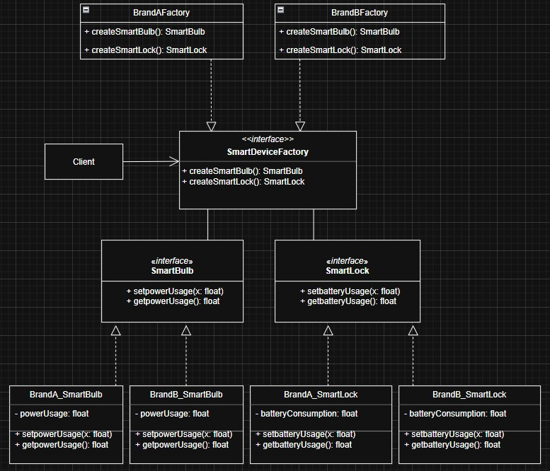

# Smart Devices Factory Assignment

This assignment demonstrates the use of the Abstract Factory and Factory Method design patterns to create smart home devices (bulbs and locks) for different brands, with usage values loaded from an external CSV file.

## UML Diagram



## Repository Structure

- `src/` — Source code for the smart device factories and products

  - `devices/` — Java classes for device interfaces, concrete device implementations, abstract and concrete factories, and the usage reader utility:
    - `SmartDeviceFactory.java` (interface)
    - `SmartBulb.java` (interface)
    - `SmartLock.java` (interface)
    - `BrandAFactory.java` (Brand A factory)
    - `BrandBFactory.java` (Brand B factory)
    - `BrandA_SmartBulb.java` (Brand A bulb)
    - `BrandB_SmartBulb.java` (Brand B bulb)
    - `BrandA_SmartLock.java` (Brand A lock)
    - `BrandB_SmartLock.java` (Brand B lock)
    - `UsageReader.java` (utility for reading usage values)
- `data/usage.csv` — CSV file containing usage values for each brand/device (e.g., power usage for bulbs, battery consumption for locks)
- `tests/` — Test drivers to demonstrate and verify the design
  - `TestDevices.java` — Main test driver for both brands
  - `TestDriver.java` — Simpler test for Brand A
- `uml/` — UML diagram source (PlantUML)

## Design Patterns Used

- **Abstract Factory Pattern:**
  - `DeviceFactory` (abstract class) defines the interface for creating families of products (`Bulb`, `Lock`).
  - `BrandAFactory` and `BrandBFactory` are concrete factories for each brand.
- **Factory Method Pattern:**
  - Each factory uses `makeBulb` and `makeLock` to defer instantiation to subclasses.
  - Usage values are set after creation using `UsageReader` (simulating an external database).

## Test Methods

- `TestDevices.java`:
  - Demonstrates creation and usage of both Brand A and Brand B devices.
  - Tests:
    - Bulb from Brand A (turn on/off, print power usage)
    - Lock from Brand B (lock/unlock, print battery consumption)
    - Also prints usage for Brand B Bulb and Brand A Lock
- `TestDriver.java`:
  - Demonstrates creation and usage of Brand A devices only (bulb and lock)

## How to Run

1. Open a terminal in the project root directory.
2. Compile all Java files:
   ```
   javac -d out -cp src src/devices/*.java tests/*.java
   ```
3. Run the main test driver:
   ```
   java -cp out devices.TestDevices
   ```
   Or run the simpler test:
   ```
   java -cp out devices.TestDriver
   ```

## Screenshots

TestDevices.java


TestDriver.java


**Note:**

- The `data/usage.csv` file must exist and contain usage values for each brand/device in the format:
  ```
  # brand,device,value
  BrandA,bulb,9.5
  BrandA,lock,1.2
  BrandB,bulb,7.5
  BrandB,lock,0.8

